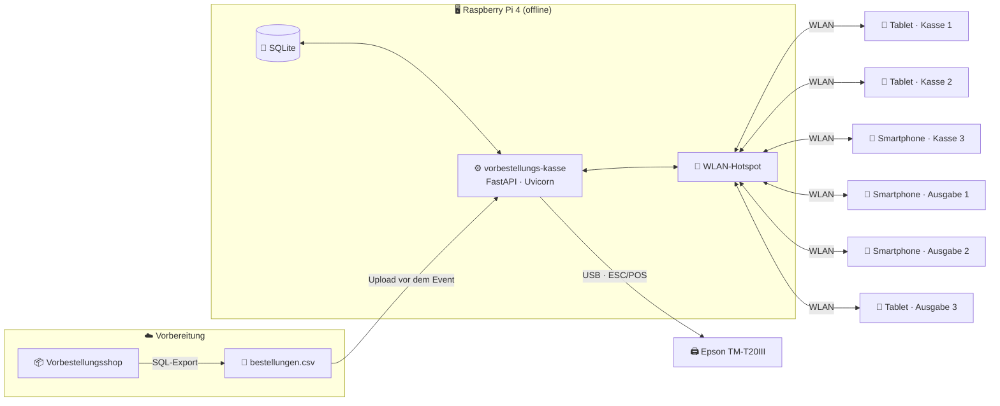
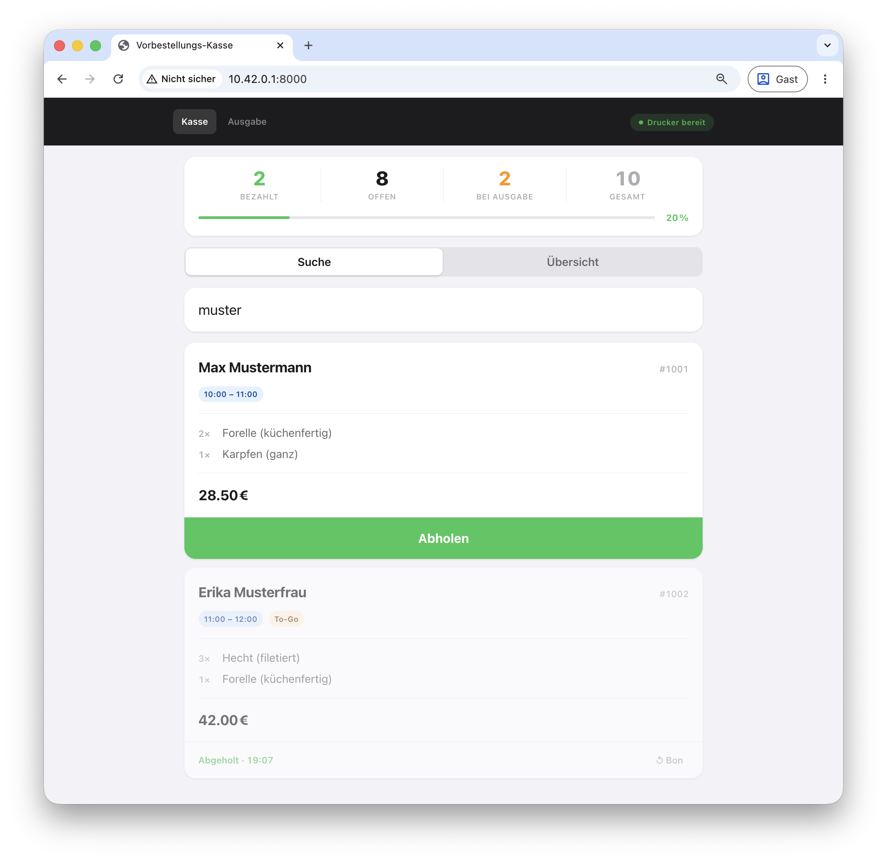
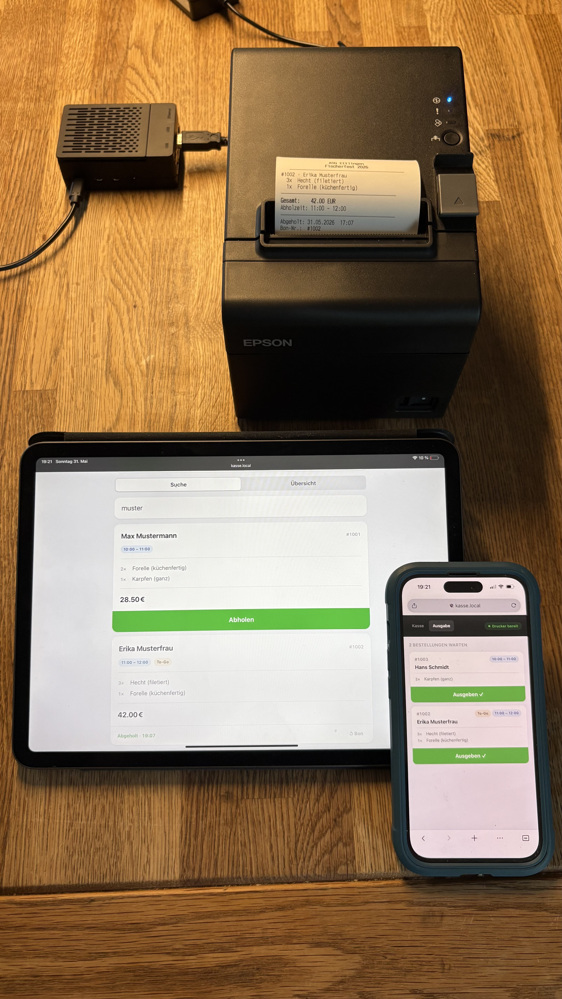

# vorbestellungs-kasse

Digitales Abholsystem für Vereinsevents mit Vorbestellungen. Läuft auf einem Raspberry Pi, baut sein eigenes WLAN auf, druckt Bons – ganz ohne Internet, Cloud oder IT-Personal.

Entstanden beim Fischerfest der ASG Ettlingen. Weil 400 Vorbestellungen, drei Papierlisten und eine manuelle Kasseneingabe irgendwann nicht mehr lustig sind.

---

## Wie es läuft

**Vorab (zuhause):** CSV aus eurem Vorbestellsystem exportieren, auf den Pi laden. Fertig.

**Am Eventtag:** Pi starten, Drucker einstecken, Tablets ins WLAN – das war's. Der Pi baut sein eigenes WLAN-Netz auf, kein Router nötig.

**An der Kasse:** Mitarbeiter suchen die Bestellung per Name, E-Mail oder Nummer. Ein Tap bestätigt die Abholung, der Bon wird gedruckt, alle Kassen synchronisieren sich sofort. Doppelt abholen ist nicht möglich.



<table>
  <tr>
    <td align="center"><br><sub>Suchmaske (Tablet)</sub></td>
    <td align="center"><br><sub>Ausgabe-Tab (Smartphone)</sub></td>
  </tr>
</table>

---

## Für euren Verein

Das System ist generisch gebaut – nicht nur für Fischerfeste. Drei Zeilen in `.env` reichen für den Anfang:

```env
VEREINSNAME=Euer Verein
EVENT_NAME=Euer Event
EVENT_JAHR=2026
```

Unterstützt werden CSV-Exporte aus WooCommerce, Shopify, Pretix, Eventbrite und eigenen Systemen. Alle Spaltennamen sind konfigurierbar. Details und Schritt-für-Schritt-Anleitung: → [docs/neuer-verein.md](docs/neuer-verein.md)

**Einmalig einrichten, jedes Jahr nutzen:** Nach dem ersten Setup startet der Pi autonom. Kein Wartungsaufwand zwischen den Events.

---

## Features

- Echtzeit-Suche nach Name, E-Mail oder Bestellnummer (Teilstrings)
- Automatischer Bondruck per ESC/POS (Epson TM-T20III)
- Live-Sync aller Tablets über Server-Sent Events – kein Reload nötig
- CSV-Import aus WooCommerce, Shopify, Pretix, Eventbrite und mehr
- Wechselgeldberechnung mit Schnellbetragsauswahl
- Vollständig offline – eigener WLAN-Hotspot

---

## Hardware

| Gerät | Rolle |
|---|---|
| Raspberry Pi 4 Model B | Server, Hotspot, Druckserver |
| Epson TM-T20III (USB, 80 mm) | Bondrucker |
| Tablets / Smartphones | Kassenoberfläche im Browser |



---

## Quick Start / Lokal ausprobieren (kein Raspberry Pi nötig)

Das System läuft auf jedem Laptop – ideal um es vor dem Event zu testen oder für einen anderen Verein anzupassen.

```bash
git clone https://github.com/ffischbach/vorbestellungs-kasse.git
cd fischverkauf
uv sync --group dev
cp .env.example .env
```

In `.env` den Druck deaktivieren:

```env
PRINTER_ENABLED=false
```

Server starten:

```bash
uv run uvicorn app.main:app --reload
```

Dann [http://localhost:8000/admin](http://localhost:8000/admin) öffnen (Standard-User: `admin` PW: `bitte-aendern`), Beispiel-CSV herunterladen, importieren – und unter [http://localhost:8000](http://localhost:8000) ausprobieren.

```bash
uv run pytest          # Tests
uv run ruff check .    # Linting
uv run mypy app        # Typchecks
```

---

## Deployment auf den Raspberry Pi

Ersteinrichtung (einmalig, mit Internet): → [docs/einrichtung.md](docs/einrichtung.md)

---

## Konfiguration

Vollständige Referenz aller `.env`-Variablen: → [docs/konfiguration.md](docs/konfiguration.md)

---

## Dokumentation

| Dokument | Inhalt |
|---|---|
| [Einrichtung (Raspberry Pi)](docs/einrichtung.md) | SD-Karte, SSH, Hotspot, systemd |
| [Checkliste Eventtag](docs/eventtag.md) | Aufbau, CSV-Import, Abbau – zum Ausdrucken |
| [Troubleshooting](docs/troubleshooting.md) | App, Hotspot, Drucker, Tablets |
| [Für euren Verein anpassen](docs/neuer-verein.md) | Andere Shops, CSV-Formate, Fork |
| [Konfigurationsreferenz](docs/konfiguration.md) | Alle `.env`-Variablen |
