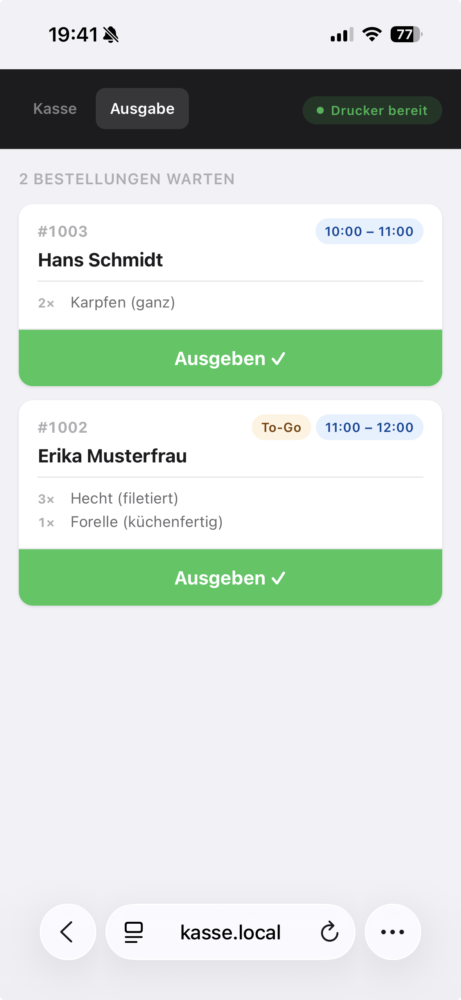

# Checkliste Eventtag

Ausdrucken, abhaken, loslegen.  
Den Hotspot-Namen und das Passwort vorher notieren:

> **WLAN SSID:** _________________________ &nbsp;&nbsp; **Passwort:** _________________________

---

## Aufbau (~10 Minuten)

- [ ] Pi ans Strom anschließen — 60 Sekunden warten
- [ ] Epson TM-T20III per USB anschließen und einschalten
- [ ] Am Tablet: WLAN-Netz suchen und verbinden
- [ ] Browser öffnen: **http://kasse.local:8000**
- [ ] Drucker-Status oben rechts prüfen → muss **«Drucker bereit»** anzeigen
- [ ] Weitere Tablets verbinden: WLAN → Browser → `http://kasse.local:8000`

> **Kassensicht:** Tab **Kasse** → Suche nach Name, E-Mail oder Nummer → Bezahlen-Button tippt Bon aus.  
> Tab **Ausgabe** (Smartphone) zeigt offene Bestellungen nach Zeitfenster sortiert.
>
> 

---

## CSV importieren (falls noch nicht vorab erledigt)

- [ ] **http://kasse.local:8000/admin** öffnen
- [ ] Passwort eingeben (Standard: user: `admin` PW: `bitte-aendern` | ansonsten Wert von ADMIN_PASSWORD in der .env Datei) 
- [ ] CSV-Datei auswählen und **Importieren** klicken
- [ ] Kurze Stichprobe: zwei oder drei Bestellungen suchen

---

## Systemstatus per SSH prüfen (optional, für den Admin)

```bash
bash scripts/status.sh
```

Zeigt ob App, Hotspot und Drucker bereit sind — inklusive der direkten IP-Adresse
falls `kasse.local` auf manchen Geräten nicht auflöst.

---

## Nach dem Event

- [ ] Pi herunterfahren:
  ```bash
  sudo shutdown -h now
  ```
- [ ] Pi und Drucker vom Strom trennen
- [ ] Falls gewollt: Bestelldaten löschen: Admin → **Alle Bestellungen löschen**

---

Probleme? → [troubleshooting.md](troubleshooting.md)
